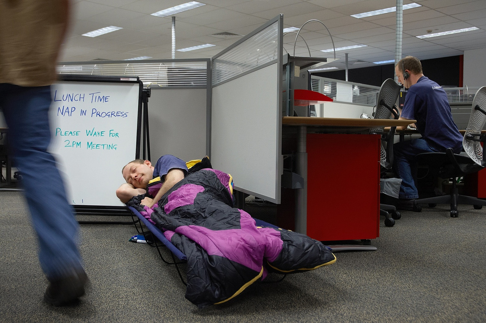

!SLIDE transition=fade
# Time to level set

!SLIDE bullets incremental transition=fade
# Rule #1: IaaS != PaaS
* IaaS focus is on VM's
* PaaS focus is on Applications

!SLIDE transition=fade
# Rule #2: PaaS is Not A

!SLIDE bullets incremental transition=fade
* Self-service environments
* Varied, volatile workloads
* Polyglot environments
* Standard deployments

!SLIDE stress bullets incremental transition=fade
# Rule #3: PaaS is about developers
* AND OPERATIONS!!

!SLIDE

!SLIDE transition=fade
# Rule #4: Be ready to learn
