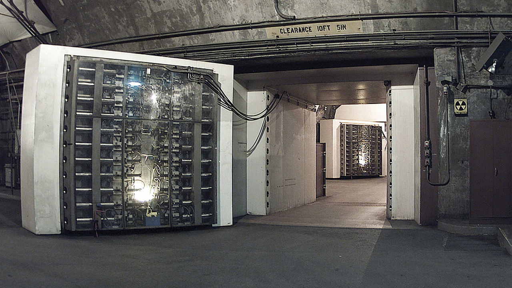

!SLIDE transition=fade
# The Future: Secure LXC

.notes The future is probably a secure version of the LXC project, which wraps
all the previous technologies together.  LXC alone isn't there yet as it
doesn't provide a secure foundation with SELinux.

!SLIDE bold center
# LXC

.notes LXC provides great privacy and segmentation, much like Japanese walls.
Elegant and a critical part of the user experience.  However, someone determined
can get through those walls.

!SLIDE bold center
# SELinux

.notes SELinux provides the core layer of security.  Your aren't going to be
able to break through it without a lot of effort.

!SLIDE bold

.notes The combination of those two technologies is where we need to get to.
Let users get the elasticity of cloud, with the power of multi-tenancy, without
having to worry about securitry.

!SLIDE transition=fade
# The Present... 

.notes Unfortunately, Secure LXC isn't a reality for us quite yet.

!SLIDE

.notes Today requires a lot of wiring of the various technologies.  It's
complicated and requires a true understanding of the operating system.

!SLIDE transition=fade
# Baby Steps

.notes With OpenShift Origin, we are going to guide users into this new space
one step at a time.  Since SELinux is the core, that is what we are starting
with.  Nice and simple - running OpenShift Origin in enforcing mode.

!SLIDE commandline incremental transition=fade
# Step 1 - Unlearn this

	$ setenforce 0
	You know who you are...

.notes PaaS demands a new security model.  The traditional discretionary access
control model (DAC) is too complicated in a PaaS environment.  Whitelisting
expected function and blocking other function is much safer.  This is Mandatory
Access Control (MAC).  This is SELinux.

!SLIDE condense commandline incremental transition=fade
# Step 2 - Learn the 'Z'

	$ ls -lZ
	drwxr-xr-x. mhicks mhicks unconfined_u:object_r:user_home_t:s0 about_me
	-rwxrwxr-x. mhicks mhicks unconfined_u:object_r:user_home_t:s0 config.ru
	drwxr-xr-x. mhicks mhicks unconfined_u:object_r:user_home_t:s0 experimental
	-rw-rw-r--. mhicks mhicks unconfined_u:object_r:user_home_t:s0 Gemfile
	-rw-rw-r--. mhicks mhicks unconfined_u:object_r:user_home_t:s0 Gemfile.lock
	drwxrwxr-x. mhicks mhicks unconfined_u:object_r:user_home_t:s0 public
	-rw-rw-r--. mhicks mhicks unconfined_u:object_r:user_home_t:s0 README.md
	drwxrwxr-x. mhicks mhicks unconfined_u:object_r:user_home_t:s0 running_paas
	-rw-rw-r--. mhicks mhicks unconfined_u:object_r:user_home_t:s0 script.js
	-rw-rw-r--. mhicks mhicks unconfined_u:object_r:user_home_t:s0 showoff.json
	-rw-rw-r--. mhicks mhicks unconfined_u:object_r:user_home_t:s0 styles.css
	drwxr-xr-x. mhicks mhicks unconfined_u:object_r:user_home_t:s0 title
	drwxrwxr-x. mhicks mhicks unconfined_u:object_r:user_home_t:s0 tmp

.notes Some simple rules to SELinux.  Learn to add 'Z' to your traditional
commands.  Let's look at listing files.  Notice the
unconfined_u:object_r:user_home_t:s0 stuff.

!SLIDE condense commandline incremental transition=fade
# Step 2 - Learn the 'Z' (cont.)

	$ ps -eZ
	LABEL                           PID       TTY       TIME        CMD
	unconfined_u:unconfined_r:unconfined_t:s0-s0:c0.c1023 9542 pts/2 00:00:00 bash
	unconfined_u:unconfined_r:unconfined_t:s0-s0:c0.c1023 9609 pts/2 00:00:00 ps -fZ

.notes Let's look at listing processes.  Same thing, this new LABEL
information.  It's pretty simple, these are new labels that the kernel will use
to decide what processes can and can't do.  Even processes running as root can
have behavior restricted by the SELinux policy.  This all starts with the
labels on those processes and files.

!SLIDE condense commandline incremental transition=fade
# Having trouble?

	$ grep -r "denied" /var/log/audit/audit.log
	See results?  If so, SELinux is blocking something...

.notes The first tool to debugging is to understand if you are hitting a
SELinux problem.  The quickest route is to check the audit log.  If you see a
denial look at what's causing it (all in the log) to see if it's legit.

!SLIDE transition=fade

.notes Think of SELinux like a new tool in your toolbelt.  It's an incredibly
powerful tool to increase the security of a somewhat user-controlled PaaS
environment.

!SLIDE bullets transition=fade
# Still Stuck?

* <http://fedoraproject.org/wiki/SELinux>

.notes If and when you do get stuck, go right to Fedora.  They have some great
resources for both learning and debugging various issues.  Also, hit us up on
the forums.

!SLIDE bullets transition=fade
# Next Step...

* [OpenShift Origin LiveCD](http://openshift.redhat.com/community/)

.notes Our goal has been to have the pieces of OpenShift installed and
configured just like you would expect them on a Linux system.  I know SELinux
will be new to many people, but hopefully you have some basic tools to get you
started.  As for everything else, download the image, fire it up and start
creating apps.  Dig in and let us know what you think.  Better yet, make your
changes and send us a pull request!
