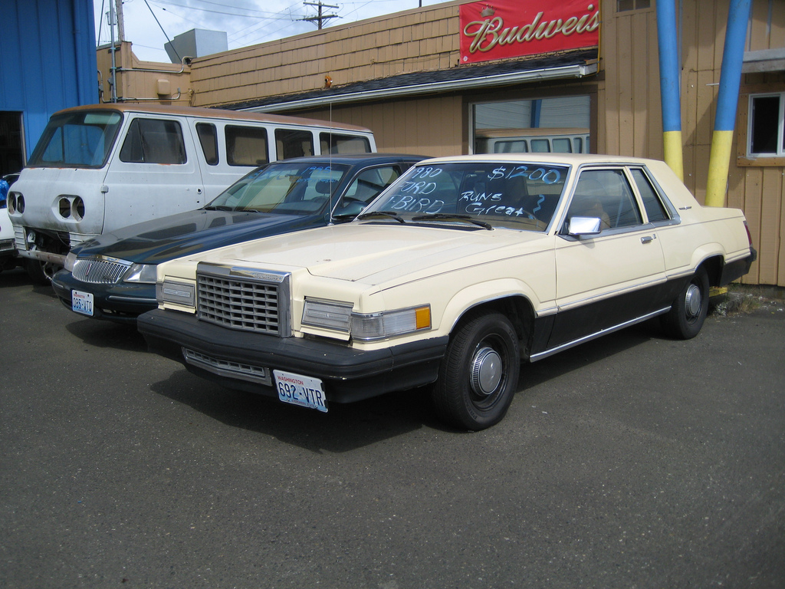

!SLIDE tech transition=fade
	@@@ Javascript

        {
          summary    : "What Developers Expect",

          language   : ['ruby' ,'python', 'java', \
                        'node.js', 'perl'],

          scaling    : 'automagic',

          extensible : true,

          continuous_integration: true
        }

!SLIDE tech bullets incremental transition=fade

	@@@ Makefile
        Name: ops-expectations

        Summary: What Operations Expects

        Require: Multi-tenancy

        Require: Familiar installation

        %post
        echo "configuration=sane" > /etc/my.conf

.notes Ops need multi-tenancy because you can't manage 10K applications, each
running on a few VM's.  No way to maintain that.

!SLIDE transition=fade

# Multi-tenancy?

!SLIDE

.notes (Some humor) Think of multi-tenancy is like taking a plain jane system
and transforming it into more than it's ever dreamed of.

!SLIDE

.notes (Some humor) What couldn't a machine like this do?

!SLIDE comic 

# Show me more!

.notes In all seriousness, multi-tenancy does allow you to get a lot our of a
traditional machine or VM.  Let's dig into how.

!SLIDE bullets incremental transition=fade

# Containers

* SELinux
* Kernel Namespaces
* Linux Control Groups
* Bind Mounts

.notes Containers is a somewhat generic term you hear tossed around, this is
what is usually boils down to referring to.
