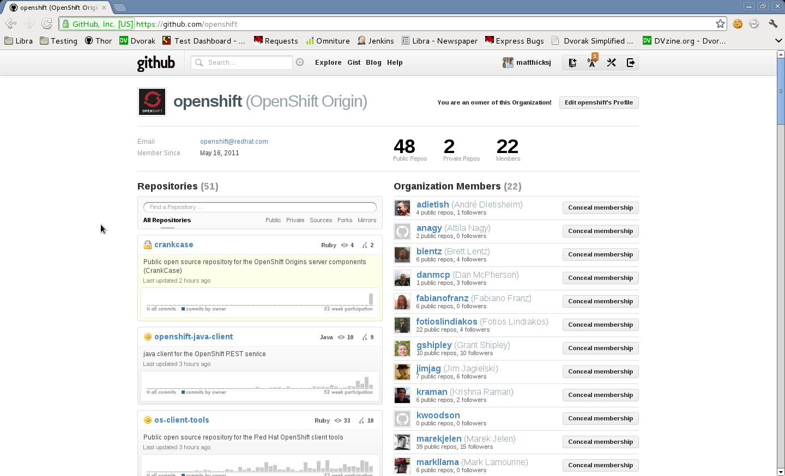

!SLIDE transition=fade
# What we just open sourced

.notes You might be familiar with OpenShift the service.  We have spent the
last 12 months focused on making a world class service.  Open sourcing was a
little challenging given the blend of software and a service.  However, there
was some cool code making this work and being Red Hat, we wanted to get that
into the open.

!SLIDE bold center

# OpenShift Origin

.notes OpenShift Origin is the name that references to the open source
offering.  Origin is very important to us because it embodies our belief that
this is just the beginning of OpenShift.  User feedback has been fundamental in
guiding our service to where it is today.  Now we are expanding the power of
the community by allowing them to interact and influence at a much more
fundamental level.

!SLIDE transition=fade
# and we've just begun...

.notes As with most open source projects, this is an exciting day, but it's
really just the beginning.  The most exciting part will be where the project
evolves from here.
